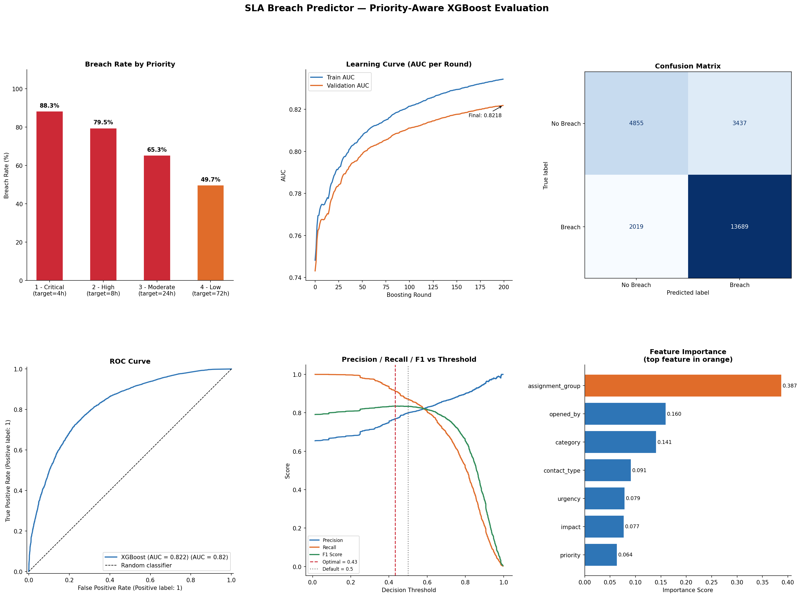

# 🚨 sla-breach-predictor

> **Predict IT incident SLA breaches before they happen — end-to-end ML pipeline with real-time AWS scoring.**


---

## 📌 Overview

IT incidents frequently miss their Service Level Agreement (SLA) targets — causing operational penalties, customer dissatisfaction, and reporting failures. This project builds a **priority-aware binary classifier** that predicts at incident creation time whether a ticket is likely to breach its SLA, enabling proactive escalation before the deadline is missed.

Trained on **119,998 real ITSM incident records**, the model achieves an **AUC of 0.8218** and is deployed as a serverless real-time scoring API via **AWS Lambda**, with all artefacts stored in **AWS S3**.

---

## 🏗️ Architecture

```
Incident Event Log  (119,998 rows)
         │
         ▼
┌─────────────────────────┐
│   ETL & Feature Eng.    │  resolution_hours · priority-aware SLA targets · breach label
└───────────┬─────────────┘
            │
            ▼
┌─────────────────────────┐
│   XGBoost Classifier    │  AUC 0.8218 · F1 0.8351 · MLflow tracked
└───────────┬─────────────┘
            │
            ▼
┌─────────────────────────┐
│   AWS S3 Bucket         │  model.pkl · encoders.pkl · metadata.json · evaluation.png
└───────────┬─────────────┘
            │
            ▼
┌─────────────────────────┐
│   AWS Lambda Function   │  Real-time breach scoring via HTTP · risk banding · recommendations
└─────────────────────────┘
```

---

## 📊 Results

| Metric | Value |
|---|---|
| Dataset size | 119,998 incidents |
| Overall breach rate | 65.5% |
| AUC Score | **0.8218** |
| Best F1 (Breach class) | **0.8351** |
| Optimal threshold | **0.433** |
| Accuracy | 0.77 |

### Breach Rate by Priority

| Priority | SLA Target | Breach Rate |
|---|---|---|
| 1 - Critical | 4 hours | 88.3% |
| 2 - High | 8 hours | 79.5% |
| 3 - Moderate | 24 hours | 65.3% |
| 4 - Low | 72 hours | 49.7% |

### Evaluation Dashboard
*6-panel evaluation plot: breach rate by priority · learning curve · confusion matrix · ROC curve · Precision/Recall/F1 vs threshold · feature importance*



---

## ⚙️ Pipeline Details

### 1. Feature Engineering
- `resolution_hours` derived from `resolved_at − opened_at`
- Priority-aware SLA targets applied per ticket tier (ITIL-aligned)
- Binary label: `sla_breach = 1` if `resolution_hours > sla_target_hours`
- 7 categorical features label-encoded; encoders saved separately for inference consistency

### 2. Model — XGBoost
- 200 boosting rounds, depth 6, learning rate 0.1
- Subsampling (0.8) and column sampling (0.8) to reduce variance
- AUC used as the optimisation metric throughout training
- Tracked with **MLflow** (`xgboost-sla-priority-aware` run)

### 3. Threshold Optimisation
The default 0.5 threshold is suboptimal for imbalanced breach detection. Sweeping the Precision-Recall curve and maximising F1 yields an **optimal threshold of 0.433**, improving Breach class recall — the higher-cost miss in production.

### 4. AWS S3 — Artefact Storage
All training outputs are uploaded to S3 for deployment and retraining:

```
s3://your-bucket/sla-breach-predictor/v1/
├── model.pkl              # trained XGBoost model
├── encoders.pkl           # label encoders (prevents training-serving skew)
├── metadata.json          # AUC, threshold, features, SLA targets
└── model_evaluation.png   # 6-panel evaluation dashboard
```

### 5. AWS Lambda — Real-Time Inference
The Lambda function loads artefacts from S3 on cold start, caches them in memory for warm invocations, and returns a breach prediction with risk banding on every call.

**Request:**
```json
{
  "priority":         "2 - High",
  "category":         "Network",
  "impact":           "2 - Medium",
  "urgency":          "2 - Medium",
  "assignment_group": "Network Operations",
  "opened_by":        "agent_42",
  "contact_type":     "Email"
}
```

**Response:**
```json
{
  "sla_breach_predicted": true,
  "breach_probability":   0.81,
  "threshold_used":       0.433,
  "risk_level":           "CRITICAL",
  "sla_target_hours":     8,
  "recommendation":       "Escalate immediately — very high breach probability"
}
```

**Risk Levels:**

| Probability | Risk | Action |
|---|---|---|
| ≥ 0.80 | 🔴 CRITICAL | Escalate immediately |
| 0.60 – 0.79 | 🟠 HIGH | Prioritise resolution |
| 0.40 – 0.59 | 🟡 MEDIUM | Monitor closely |
| < 0.40 | 🟢 LOW | Normal workflow |

---


---

## 🚀 Quickstart

### Run the notebook
Open directly on Kaggle:  
[📓 View Notebook on Kaggle](#) ← add your Kaggle link here

### Deploy Lambda locally (test)
```python
# Simulate a Lambda call using in-memory model
result = local_predict({
    "priority":         "1 - Critical",
    "category":         "Network",
    "impact":           "1 - High",
    "urgency":          "1 - High",
    "assignment_group": "Network Operations",
    "opened_by":        "agent_01",
    "contact_type":     "Phone"
})
print(result)
# {'sla_breach_predicted': True, 'breach_probability': 0.88, 'risk_level': 'CRITICAL', ...}
```

### Deploy to AWS Lambda
1. Create a Lambda function (Python 3.11, 512 MB, 30s timeout)
2. Attach IAM role with `s3:GetObject` on your bucket
3. Set environment variables: `S3_BUCKET`, `S3_PREFIX`, `OPTIMAL_THRESHOLD`
4. Upload `lambda/lambda_function.py`
5. Add a **Function URL** or **API Gateway** trigger

---

## 🛠️ Tech Stack

| Layer | Tools |
|---|---|
| Data processing | Python · pandas · NumPy |
| Machine learning | XGBoost · scikit-learn |
| Experiment tracking | MLflow |
| Visualisation | matplotlib |
| Cloud storage | AWS S3 · boto3 |
| Inference | AWS Lambda |
| Notebook | Kaggle |

---

## 📦 Dataset

[Incident Response Log — Vipul Shinde](https://www.kaggle.com/datasets/vipulshinde/incident-response-log)  
119,998 ITSM incident records with timestamps, priority, category, impact, urgency, and resolution data.

---

## 👩‍💻 Author

**Shivani Sharma**  
Data Analyst & Analytics Engineer  
[LinkedIn](https://www.linkedin.com/in/shivani-s-386872148) · [Portfolio](https://sharmashivani12.github.io/shivani-portfolio/)
